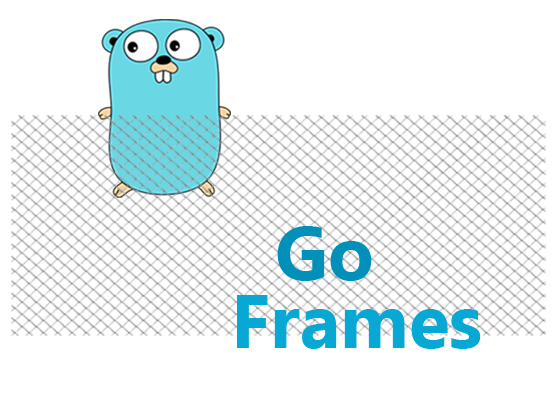

# Go-Frames

## Introduction

Go-Frames is an ongoing project to build a clone for the python pandas library in Go. This requires an abstract data
structure, that is equivalent to Pandas dataframes and a vast collection of methods that goes along with it. Project is
planned to be extended for machine learning as well by closely following the Sklearn library in Python which would be
compliment to the Go-Frames library. The goal of the project is to get python data scientists to quickly migrate their
code bases to Go for improved performances.

## Basic Usage

### Installation

```bash
go get github.com/pandulaDW/go-frames
```

### Creating a Series

A series is the building block of DataFrames. Only a column name and variadic amount of empty interface values are
needed to create a series. Internally, the series will be type inferred to be one of Int, Float, Bool, DateTime and
Object(text) types.

```go
package main

import (
	"fmt"

	"github.com/pandulaDW/go-frames/series"
)

func main() {
	s1 := series.NewSeries("col1", 12, 43, 53, 14, 10)
	s2 := series.NewSeries("col2", "foo", "bar", "baz")
	s3 := series.NewSeries("col3", 12.3, 1.43, 4.5)
	s4 := series.NewSeries("col4", true, false, false, true)
	s5 := series.NewSeries("col4", "2010-01-02", "2010-01-02")
}
```

### Creating a DataFrame

A dataframe can be created using a list of series objects provided as variadic parameters to the dataframe constructor.

```go
package main

import (
	"fmt"

	"github.com/pandulaDW/go-frames/series"
	"github.com/pandulaDW/go-frames/dataframes"
)

func main() {
	col1 := series.NewSeries("col1", 12, 34, 54, 65, 90)
	col2 := series.NewSeries("col2", "foo", "bar", "raz", "apple", "orange")
	col3 := series.NewSeries("col3", 54.31, 1.23, 45.6, 23.12, 23.2)
	col4 := series.NewSeries("col4", true, false, true, true, false)
	col5 := series.NewSeries("col5", "2013/04/05", "2023/03/01", "2013/01/05", "2009/07/15", "2011/02/01")
	_ = col5.CastAsTime("2006/01/02")

	df := dataframes.NewDataFrame(col1, col2, col3, col4, col5)
	fmt.Println(df)
}
```

The above snippet will display the below output.

````shell
+-+----+------+-----+-----+-----------+
| |col1|  col2| col3| col4|       col5|
+-+----+------+-----+-----+-----------+
|0|  12|   foo|54.31| true| 2013-04-05|
|1|  34|   bar| 1.23|false| 2023-03-01|
|2|  54|   raz| 45.6| true| 2013-01-05|
|3|  65| apple|23.12| true| 2009-07-15|
|4|  90|orange| 23.2|false| 2011-02-01|
+-+----+------+-----+-----+-----------+
````

### Calling methods

DataFrame's methods can be chained together to mutate the current DataFrame object. A series can be individually
accessed using the DataFrame object and can be mutated or information can be extracted just as same.

```go
package main

import (
	"fmt"

	"github.com/pandulaDW/go-frames/ioread"
)

func main() {
	df, _ := ioread.ReadCSV(ioread.CsvOptions{Path: "data/youtubevideos.csv"})

	// calling the underlying series
	maxViews := df.Data["views"].Max()

	// mutating current dataframe
	df.RenameColumn("title", "Title")

	// creating a new dataframe without modifying underlying data
	dfNew := df.ShallowCopy().Select("tags", "views", "likes")
}
```

### Reading files

GoFrames allows reading and writing to files from various sources such as Csv, Excel, Json, Parquet and SQL Tables.
Also, a rich set of options are available to reduce the post-processing.

```go
package main

import (
	"fmt"
	"log"
	"time"

	"github.com/pandulaDW/go-frames/ioread"
)

func main() {
	df, err := ioread.ReadCSV(ioread.CsvOptions{Path: "data/youtubevideos.csv",
		DateCols: []string{"publish_time"}, DateFormat: time.RFC3339})

	if err != nil {
		log.Fatal(err)
	}

	fmt.Println(df.Info())
}
```

The above snippet will display the below output.

````shell
+--+----------------------+--------------+--------+
|  |                Column|Non-Null Count|   Dtype|
+--+----------------------+--------------+--------+
| 0|              video_id|40949 non-null|  Object|
| 1|         trending_date|40949 non-null|  Object|
| 2|                 title|40949 non-null|  Object|
| 3|         channel_title|40949 non-null|  Object|
| 4|           category_id|40949 non-null|     Int|
| 5|          publish_time|40949 non-null|DateTime|
| 6|                  tags|40949 non-null|  Object|
| 7|                 views|40949 non-null|     Int|
| 8|                 likes|40949 non-null|     Int|
| 9|              dislikes|40949 non-null|     Int|
|10|         comment_count|40949 non-null|     Int|
|11|        thumbnail_link|40949 non-null|  Object|
|12|     comments_disabled|40949 non-null|    Bool|
|13|      ratings_disabled|40949 non-null|    Bool|
|14|video_error_or_removed|40949 non-null|    Bool|
|15|           description|40949 non-null|  Object|
+--+----------------------+--------------+--------+
dtypes: float(0), int(5), object(7), datetime(1), bool(3)
memory usage: 63.98 MB
````

## Contributing

Contributions are welcome! Open a pull request to fix a bug, or open an issue to discuss a new feature or change. XML is
compliant
with [part 1 of the 5th edition of the ECMA-376 Standard for Office Open XML](http://www.ecma-international.org/publications/standards/Ecma-376.htm)
.

## Licenses

This program is under the terms of the BSD 3-Clause License.
See [https://opensource.org/licenses/BSD-3-Clause](https://opensource.org/licenses/BSD-3-Clause).

The Excel logo is a trademark of [Microsoft Corporation](https://aka.ms/trademarks-usage). This artwork is an
adaptation.

gopher.{ai,svg,png} was created by [Takuya Ueda](https://twitter.com/tenntenn). Licensed under
the [Creative Commons 3.0 Attributions license](http://creativecommons.org/licenses/by/3.0/).
